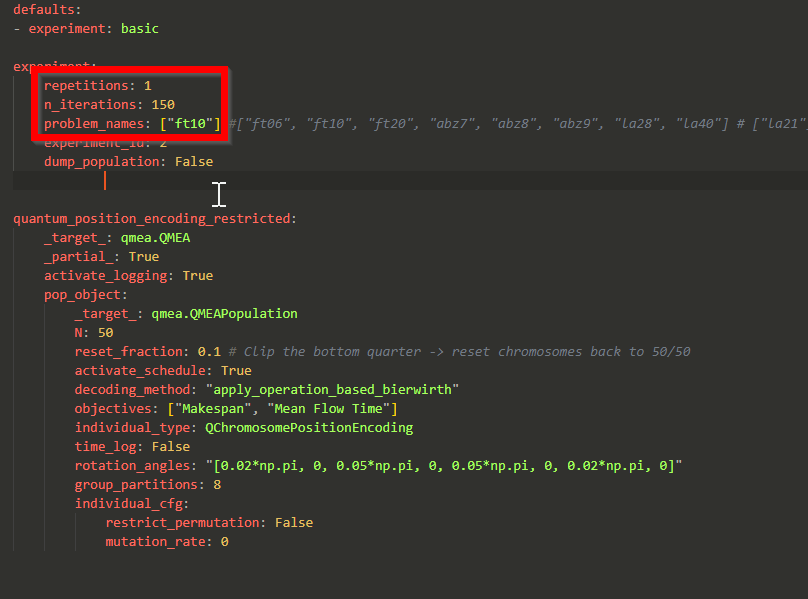

## QGA_JSSP

This repository contains teh code base for the master thesis "Multi-objective Quantum Genetic Algorithm for classical Job-shop scheduling". 

### Content

The folder called "alg" contains different algorithms:
* Knapsack_qga.py - implementation of the QEA proposed by (Han & Kim, 2002). Run the file with python in an environment with numpy.
* NSGA-II for the multi-objective JSSP (from (Deb et al., 2002))
* The QMGA algorithm for multi-objective JSSP with three different representation designs: rQMGA, rkQMGA and srkQMGA

Note that the NSGA-II and the QMGA algorithms are located under alg/NSGA_II. The algorithms can be run by executing the run_algorithm.py script. If the experiment should be executed without GUI and performance logging, the run_experiment.py should be used. The algorithms are generally constructed by separating the population object, individual (solution) object and the overall algorithm class. A lot of the code created for the algorithms can be found under qga_lib in files like individual.py (contains all the different representation that were tried), nsga_population.py (contains fast-non-dominated sorting and crowding distance), schedules (contains hybrid GT).

### Running the optimizers for the multi-objective JSSP
To run the algorithms, the python environment needs to be installed first. This can be done by creating a virtual environment locally on the computer and installing the content of the requirements.txt file. Note also that the install.py file must be executed to install the library code for the algorithm. 

The configuration for the algorithm execution can be changed in the QGA_JSSP\alg\NSGA_II\conf file location. In this case Hydra was used to handle configurations for the experiments.To run one of the algorithms, pick a config file (for example experiment_rkQMGA.py) and run the following command:
python .\alg\NSGA_II\run_algorithm.py -cn experiment_rkQMGA.yaml

Make sure that the repetitions parameter is set to 1 and adjust the number of generations if the goals is to just test the algorithm. Adjust also the list of benchmark problems:

If docker is installed, the command docker compose build && docker compose up can be run in the root folder of the repository. 
The results of the algorithm run are stored under the logdata folder in the repository root. In that folder a csv file with the metrics for each repetition and iteration is saved as well as plots of the objective space and gnat-charts for some of the solutions in the pareto-front.

### References
* Han, K.-H., & Kim, J.-H. (2002). Quantum-inspired evolutionary algorithm for a class of combinatorial optimization. IEEE Transactions on Evolutionary Computation, 6(6), 580–593. https://doi.org/10.1109/TEVC.2002.804320
* Deb, K., Pratap, A., Agarwal, S., & Meyarivan, T. (2002). A fast and elitist multiobjective genetic algorithm: NSGA-II. IEEE Transactions on Evolutionary Computation, 6(2), 182–197. IEEE Transactions on Evolutionary Computation. https://doi.org/10.1109/4235.996017

